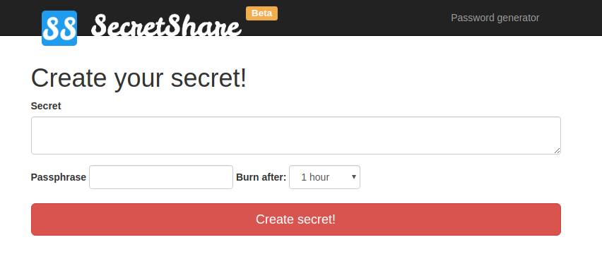

# SecretShare
> Stay safe and share your secrets

Web application to share you secret *more* secure way.

## Release History

* 0.1.0
    * The first proper release

## Meta

Piotr Jarosz @ Icoqu – [@piotr-jarosz](https://linkedin.com/in/piotr-jarosz) – piotr.jarosz [at] icoqu.com

Distributed under the MIT license. See ``LICENSE`` for more information.

[https://github.com/piotr-jarosz](https://github.com/piotr-jarosz/)

## Contributing

1. Fork it (<https://github.com/yourname/yourproject/fork>)
2. Create your feature branch (`git checkout -b feature/fooBar`)
3. Commit your changes (`git commit -am 'Add some fooBar'`)
4. Push to the branch (`git push origin feature/fooBar`)
5. Create a new Pull Request

###TO DO CHAPTERS:
## Installation
## Usage example
## Development setup
